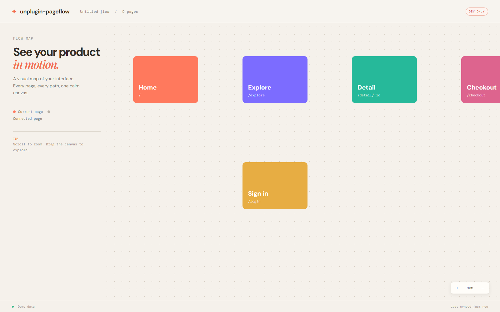

# unplugin-pageflow

> See every Vue page and navigation path on one infinite canvas.

[](https://github.com/fitoe/unplugin-pageflow/actions/workflows/ci.yml)


`unplugin-pageflow` is a development-only visual map for Vue Router applications. It discovers routes, renders real pages, highlights navigation hotspots, and draws page relationships—without touching your production bundle.



## Why

- **See the whole product** — browse every route on a zoomable LeaferJS canvas.
- **Preview real pages** — inspect the actual Vue application through same-origin iframes.
- **Understand navigation** — detect `<RouterLink>`, anchors, and literal `router.push()` / `router.replace()` targets.
- **Stay in flow** — route and link changes update through Vite HMR.
- **Dev only** — no PageFlow runtime is injected into production builds.

## Install

```bash
npm install -D unplugin-pageflow
```

```ts
// vite.config.ts
import vue from '@vitejs/plugin-vue'
import PageFlow from 'unplugin-pageflow'
import { defineConfig } from 'vite'

export default defineConfig({
  plugins: [
    vue(),
    PageFlow.vite(),
  ],
})
```

Start Vite as usual:

```bash
npm run dev
```

The CLI prints the preview URL:

```text
unplugin-pageflow  http://localhost:5173/__unplugin-pageflow/
```

## Options

```ts
PageFlow.vite({
  enabled: true,
  previewPath: '/__unplugin-pageflow/',
  appUrl: '/',
  dynamicParams: {
    '/products/:id': { id: 'demo-product' },
  },
})
```

| Option | Default | Description |
| --- | --- | --- |
| `enabled` | `true` | Enable the development tool. |
| `previewPath` | `/__unplugin-pageflow/` | URL of the visual map. |
| `appUrl` | `/` | Route used to discover the Vue Router instance. |
| `dynamicParams` | `{}` | Sample values for dynamic route parameters. |

## How it works

The Vite plugin injects a small runtime only while the dev server is running. The runtime reads `router.getRoutes()`, reports visible navigation hotspots, and sends graph updates to the PageFlow client. LeaferJS renders the infinite canvas and relationships; same-origin iframes render the real pages.

Large projects remain usable through viewport-based iframe mounting and sequential background link discovery.

## Preview safety

Preview mode blocks anchor navigation and form submission. It does not click controls, bypass authentication, or suppress application startup side effects. Use local or test data for pages that perform writes during initialization.

## Current scope

- Vite is the fully supported adapter.
- History-mode Vue Router is the primary supported setup.
- Computed programmatic destinations are discovered after the corresponding interaction occurs.
- Authentication and route-specific state come from the current browser session.

## Development

```bash
npm install
npm run playground
npm run check
```

Requires Node.js `>=20.19` and npm `>=10`.

<details>
<summary><strong>中文说明</strong></summary>

`unplugin-pageflow` 是一个仅在开发环境运行的 Vue Router 页面流程可视化插件。它会自动发现路由，在无限画布中展示页面，标记页面跳转热区，并绘制页面之间的导航关系；生产构建不会注入 PageFlow 代码。

### 安装

```bash
npm install -D unplugin-pageflow
```

```ts
// vite.config.ts
import vue from '@vitejs/plugin-vue'
import PageFlow from 'unplugin-pageflow'
import { defineConfig } from 'vite'

export default defineConfig({
  plugins: [vue(), PageFlow.vite()],
})
```

正常启动项目：

```bash
npm run dev
```

CLI 会输出预览地址：

```text
unplugin-pageflow  http://localhost:5173/__unplugin-pageflow/
```

主要能力：

- 自动发现 Vue Router 路由
- 在 LeaferJS 无限画布中展示页面关系
- 使用同源 iframe 渲染真实页面
- 识别 `<RouterLink>`、同源链接和字面量程序式跳转
- 支持动态路由示例参数、HMR 和大规模页面虚拟化
- 仅开发环境启用，不进入生产产物

动态路由可以配置示例参数：

```ts
PageFlow.vite({
  dynamicParams: {
    '/products/:id': { id: 'demo-product' },
  },
})
```

要求 Node.js `>=20.19`、npm `>=10`。当前以 Vite 和 history 模式 Vue Router 为主要支持范围。

</details>
