  <section class="pf-hero">
    

      
 开源开发工具

      <h1>看见每个页面， <em>理解每条路径。</em></h1>
      
自动发现路由、预览真实页面，并在一张无限画布上追踪应用中的导航关系。

      

        <a class="pf-button pf-button-primary" href="./guide/getting-started">快速开始 →</a>
        <a class="pf-button pf-button-secondary" href="https://github.com/fitoe/unplugin-pageflow">查看 GitHub</a>
      

      

        自动发现
        仅限开发环境
        支持多种框架
      

    

    

      

        
<i></i><i></i><i></i>

        PageFlow · my-app
        <b>实时</b>
      

      

        <aside aria-hidden="true">
          <strong>地图</strong>
          页面
          搜索
          设置
          <small>8 个页面 12 条连接</small>
        </aside>
        

          
        

      

    

  </section>

  <section class="pf-frameworks" aria-label="支持的框架">
    适配你的技术栈
    <a href="./integrations/">Vue</a>
    <a href="./integrations/">React</a>
    <a href="./integrations/">Nuxt</a>
    <a href="./integrations/">Next.js</a>
    <a href="./integrations/">SvelteKit</a>
    <a href="./integrations/">Astro</a>
    <a href="./integrations/">更多</a>
  </section>

  <section class="pf-section">
    

      它能做什么
      <h2>让整个应用， 清晰可见。</h2>
      
不再靠记忆拼凑产品结构。PageFlow 把路由和导航转换成一张团队都能探索的地图。

    

    

      <article>
        <b>01</b>
        <h3>看见每个页面</h3>
        
自动发现应用路由，并将它们排列在可缩放的无限画布上。

      </article>
      <article>
        <b>02</b>
        <h3>预览真实界面</h3>
        
直接查看同源页面预览，不再依赖过时截图或割裂的线框图。

      </article>
      <article>
        <b>03</b>
        <h3>理解导航关系</h3>
        
识别导航热点，追踪每次交互如何把一个页面连接到下一个页面。

      </article>
    

  </section>

  <section class="pf-install">
    

      几分钟即可开始
      <h2>一个插件， 看清整个应用。</h2>
    

    

      <code><i>$</i> pnpm add -D unplugin-pageflow</code>
      <a href="./guide/getting-started">阅读指南 →</a>
    

  </section>

